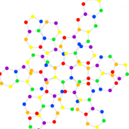

--- 
title: The Core Network
authors: Adam Apollo
layout: post
---

_Geometric System Interface_

The Core Network is a social browser and visual interface based on the geometry and physics of space-time itself.  It traces our interactions and relationships with information displayed using colors and geometric shapes, while organizing them by shared keywords, categories, and proximity references. Through this organization of personal preferences and community interactions the system enables us to more clearly see how we are related to each other, as well as how closely we are connected.

The interface functions like a multidimensional map, with each user at the center of their own personal browser.  The user's social and information networks, from people to bookmarked websites, surround them elegantly displayed in a color-coded geometric matrix.  Items they  interact with regularly position themselves adjacent to their "avatar" in the honeycomb grid,  while items they interact with less often are displayed further away.  Each connection in the grid is organically organized by relationship categories based on similar tags or keywords.  For ease of display and efficient user referencing these categories are simply represented by color-coded points.

The system is designed to aggregate data from a variety of social networks and search engines. It can be used as both a standalone browser or module that can be inserted into any existing website or application. Priorities in this interface design are flexibility and ease of use. The map is rendered and displayed with smooth physics-based movement and reorients itself according to your searches or general navigation.  The geometric structure can be rendered in 2D and 3D, as well as display changes in interactions over time.
