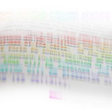

--- 
title: ForkDiffMerge
authors: Harlan Knight Wood
layout: post
---

_Large Scale Parallel Creative Collaboration_

Wikis have revolutionized textual information sharing. Documents created by harnessing collective collaboration far outperform previous modes of knowledge aggregation. Wikipedia has amply demonstrated effectiveness of this approach.

In the ForkDiffMerge collaboration platform, contributors do not have to agree on a single version; each author can maintain their own latest version.  This "branching" of creative works encourages a diversity of perspectives that can be exchanged and interwoven in a creative network of any scale.  Authors can create unlimited branches, easily view differences between branches, and merge in changes from other versions and authors.

The vision of ForkDiffMerge is to create a self-evolving container for collective intelligence to congregate around a project, while retaining the edits and contributions of every individual throughout the history of the collaboration.

* See also: [Massively Parallel Academic Research Collaboration System][]

[Massively Parallel Academic Research Collaboration System]: /Massively_Parallel_Academic_Research_Collaboration_System