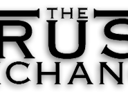

--- 
title: Trust Exchange
authors: Harlan Knight Wood
layout: post
---

_Superseding the Scarcity Economy_

The Trust Exchange utilizes the network of trust relationships that already exist, making them visible, interlinked and actionable.  Most of our decisions are based on collective opinions and discernment, particularly those of friends we trust.  The Trust Exchange brings visibility to your friends' ratings of products, companies, websites, and more.  In turn, you can rate your trust level of a friend or information source in any category, where categories are simply user-created tags.  One friend you may trust for their computer knowledge and another for their culinary capacity.

The Trust Exchange amalgamates existing ratings from any source, feeding them into an open platform.  Instead of owning your ratings and trust information, like existing online networks and organizations, the Trust Exchange is a simple and powerful open platform for humanity to exchange its trust information.  Individuals can choose whether to make ratings publicly available, or share them privately with trusted friends.

The purpose of the Trust Exchange is to support and facilitate the era of transparency that is emerging.  Anyone doing research on a purchase can tap into the publicly available ratings of relevant companies to help them choose a product or supplier aligned with their own values.  Corporations, too, can become model citizens when social capital is tied closely enough to revenue.  The engine of capitalism then becomes an engine for systemic self-improvement.

<h2>Solutions to our Biggest Issues</h2>
Corporations tend to pursue profit, often disregarding the good of the communities and the planet. There is a promising movement in the corporate world toward social and environmental responsibility.  This trend could be greatly accelerated by increasing transparency and allowing consumers to "vote" with their dollars. If customers were directly telling a corporation when they were (and were not) purchasing from them, then both the corporation and the shareholders would see that, even from a pure profit motive, it is in their best interest to move toward the values of the consumer.

In the political realm, citizens suffer from a lack of transparency, getting their information from sources they don't really trust, simply because trusted information is not readily available. The Trust Exchange would make highly rated news media (text, audio, video) readily accessible by filtering it through your trust network.
<h2 id="who_benefits">Who Benefits</h2>
Unlike today's (mostly proprietary) rating systems, the public at large can benefit from the ratings exposed through the Trust Exchange. We do not propose to build another silo of proprietary information. We propose to build the network that links existing trust ratings together and inspires people to create new ratings and thereby sharing their valuable knowledge with their friends.

Anyone doing research on a purchase could tap into the publicly available ratings of relevant companies to help them choose a product or supplier aligned with their own values. Users with rich online social networks would benefit even more by inheriting ratings created by their trusted contacts. Corporations and governments will have much better information about the real desires and priorities of their customers and citizens.
<h2 id="initial_steps">Initial Steps</h2>
<ul>
	<li>Define a simple standard for exchanging ratings</li>
	<li>Define a "microformat" to expose ratings from any site</li>
	<li>Create a free, open source crawler to collate ratings</li>
	<li>Create a free, open source Trust Exchange web application, which can be used to gather trust ratings for a given organization. Any site could collect trust ratings from its users, either by dropping a Trust Exchange widget into their existing site code, or by installing the free Trust Exchange web application.</li>
	<li>Create a coalition of leading social networking and search companies, willing to implement the Trust Exchange protocol, and allow their users to share trust data across networks.</li>
	<li>Add Trust Exchange ratings from your community to product, news, and media search results</li>
</ul>
<h2 id="optimal_outcome__measuring_success">Optimal Outcome &amp; Measuring Success</h2>
Level one of success: popular product search sites have integrated trust exchange ratings from the trust network of the current user.

Level two: influential organizations publish amalgamations of ratings from individuals and other organizations, which begin to have noticeable impact on the stock market.

Level three: the Trust Exchange begins to have an impact on elections - as your trust network automatically percolates its recommendations to you.
